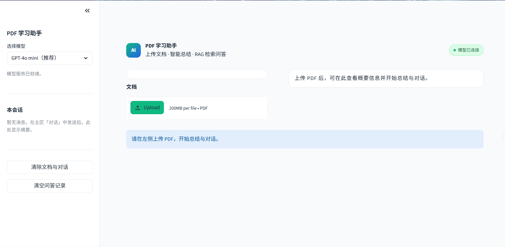
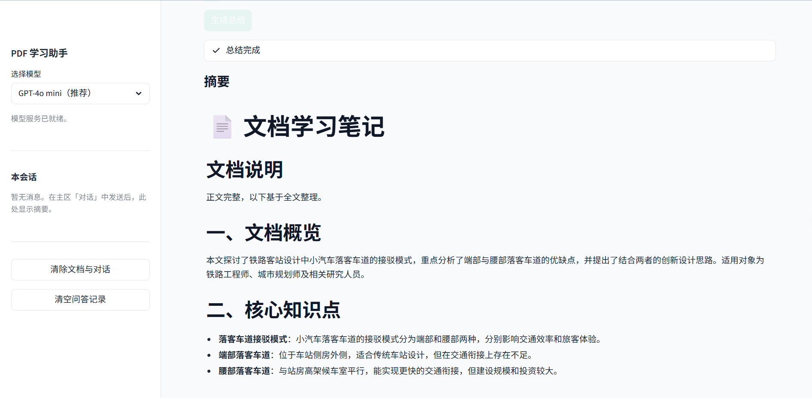

# AI PDF 学习助手

<p align="center">
  <strong>上传 PDF · 智能总结 · RAG 检索问答</strong><br/>
  <sub>Streamlit · LangChain · ChromaDB · OpenAI Compatible API</sub>
</p>

<p align="center">
  
  
  
  
</p>

<p align="center">
  <em>AI PDF Learning Assistant — upload a PDF, get structured study notes, and chat with your document using RAG.</em>
</p>

---

## 目录

- [项目预览](#项目预览)
- [1. 项目介绍](#1-项目介绍)
- [2. 功能特点](#2-功能特点)
- [3. 示例问题](#3-示例问题)
- [4. 技术栈](#4-技术栈)
- [5. 项目结构](#5-项目结构)
- [6. 安装教程](#6-安装教程)
- [7. 环境配置](#7-环境配置)
- [8. 启动方法](#8-启动方法)
- [9. API 配置方法](#9-api-配置方法)
- [10. 当前限制](#10-当前限制)
- [11. 安全与隐私说明](#11-安全与隐私说明)
- [12. 部署说明：Streamlit Cloud](#12-部署说明streamlit-cloud)
- [13. 后续规划](#13-后续规划)
- [14. License](#14-license)
- [开发与贡献](#开发与贡献)

---

## 项目预览

应用支持 PDF 上传与正文提取、结构化智能总结，以及基于文档片段的 RAG 检索问答，并提供统一的浅色界面体验。

**在线 Demo**：暂未部署（可自行 Fork 后按下文部署到 Streamlit Cloud）。

下面展示项目的主要页面效果，包括文档上传、智能总结和 RAG 问答。

<p align="center">
  
</p>
<p align="center"><sub>主界面：上传 PDF、查看文档概览与 RAG 状态</sub></p>

<p align="center">
  
</p>
<p align="center"><sub>智能总结：生成结构化学习笔记</sub></p>

<p align="center">
  
</p>
<p align="center"><sub>RAG 问答：基于文档内容的多轮对话</sub></p>

---

## 1. 项目介绍

**AI PDF 学习助手** 是一款面向学习与备考场景的 Web 应用。用户上传 PDF 后，系统自动提取正文，并基于大语言模型提供：

- **结构化学习笔记总结**（核心知识点、考试重点、复习问题等）
- **RAG 检索问答**（在文档范围内检索并作答，降低幻觉风险）

项目采用 `app.py` 作为统一入口，并使用 `src/` 目录进行模块化拆分，包括配置管理、PDF 解析、LLM 调用、RAG 服务和 UI 组件，便于后续维护、扩展和部署。配置通过 **`.env` 环境变量**（`python-dotenv`）与 Streamlit Secrets 管理，适合作为作品集展示端到端 AI 应用开发能力。

---

## 2. 功能特点

| 能力 | 说明 |
|------|------|
| PDF 解析 | 基于 `pypdf` 提取可选中文字；扫描版无文本时给出明确提示 |
| 智能总结 | 按固定 Markdown 模板生成复习向学习笔记（概览、知识点、考点、自测题等） |
| RAG 问答 | LangChain 分块 + OpenAI Embedding + Chroma 持久化向量库 |
| 向量索引重建 | 解析成功后可手动「重新建立向量索引」，并展示建索引调试信息 |
| 问答策略 | 普通问答基于检索片段生成回答；宽泛总结类问题自动切换为全文总结逻辑 |
| 多模型切换 | 侧栏选择对话模型（可配置列表）；Embedding 模型独立配置 |
| 固定浅色界面 | 统一浅色主题，覆盖侧栏、上传区、表单与提示组件，不依赖系统深色模式 |
| 错误处理 | 统一 `AppError` 分类（网络、认证、限流、Token 超限、Chroma 写入等） |
| 工程化 | `pytest` 单测、GitHub Actions CI（`compileall` / `ruff` / `pytest`） |

---

## 3. 示例问题

上传 PDF 并建立向量索引后，可在 **对话** 标签页尝试例如：

- 这篇文档主要讲什么？
- 请总结这篇论文的研究背景、研究方法和结论。
- 文中的核心模型是什么？
- 作者提出了哪些创新点？
- 请根据文档内容生成复习提纲。
- 文中某个概念是什么意思？

侧栏还提供快捷提问按钮；总结类表述会优先走全文总结逻辑，细节问题则走 RAG 检索。

---

## 4. 技术栈

| 类别 | 技术 |
|------|------|
| 前端 / 交互 | [Streamlit](https://streamlit.io/) |
| PDF | [pypdf](https://pypi.org/project/pypdf/) |
| LLM 客户端 | [OpenAI Python SDK](https://github.com/openai/openai-python)（兼容 OpenAI 协议网关） |
| RAG 编排 | [LangChain](https://www.langchain.com/) |
| Embedding | `langchain-openai` |
| 向量库 | [ChromaDB](https://www.trychroma.com/)（`langchain-chroma`） |
| 文本分块 | `langchain-text-splitters` |
| Markdown 渲染 | `markdown` |
| 配置加载 | `python-dotenv` |
| 语言 | Python 3.10+ |

---

## 5. 项目结构

```
pdf-learning-assistant/
├── app.py                      # 应用入口
├── pyproject.toml              # 项目元数据与依赖
├── requirements.txt            # 运行时依赖
├── LICENSE                     # MIT
├── .env.example                # 环境变量示例（无真实密钥）
├── .github/workflows/ci.yml    # 持续集成
├── .streamlit/                 # Streamlit 主题与 secrets 示例
├── docs/
│   ├── RAG_SCORING.md          # RAG 检索分数与阈值说明
│   └── assets/                 # 项目截图（见「项目预览」）
├── tests/                      # 单元测试
├── data/chroma/                # 向量库持久化（本地，已 gitignore）
└── src/
    ├── bootstrap.py            # 启动检查、.env 加载、目录初始化
    ├── core/                   # 常量、领域异常
    ├── config/                 # settings + secrets_provider
    ├── prompts/                # LLM 系统提示词
    ├── utils/                  # PDF、文本、Token、RAG 分数等工具
    ├── services/               # Document / LLM / RAG 业务层
    └── ui/                     # Streamlit 页面与组件
        ├── main.py
        ├── theme.py
        ├── styles.py           # 浅色主题 CSS
        ├── session.py
        └── components/
            ├── sidebar.py
            ├── summary_tab.py
            └── chat_tab.py
```

**数据流概览**

```
PDF 上传 → DocumentService（解析 + 建索引）
         → 总结：LLMService + 全文（可截断）
         → 对话：RAGService 检索 → LLMService（片段或全文总结）
```

---

## 6. 安装教程

### 前置条件

- Python **3.10+**（推荐 3.11）
- 可访问的 **OpenAI 兼容 API**（对话 + Embedding）
- Git（克隆仓库时）

### 步骤

```bash
# 1. 克隆仓库（请将 <your-username> 替换为你的 GitHub 用户名）
git clone https://github.com/<your-username>/pdf-learning-assistant.git
cd pdf-learning-assistant

# 2. 创建虚拟环境（推荐）
python -m venv .venv

# Windows
.venv\Scripts\activate

# macOS / Linux
source .venv/bin/activate

# 3. 安装依赖
pip install -r requirements.txt

# 4. 配置 API（见第 7、8 节）
```

### 开发依赖（可选）

```bash
pip install -e ".[dev]"
# 或
pip install pytest ruff
```

---

## 7. 环境配置

**读取优先级**（高 → 低）：环境变量（`.env`）→ Streamlit Secrets → 可选的 `src/app_settings.py`（已 gitignore）。

本地开发推荐：复制 [`.env.example`](.env.example) 为 `.env` 并填写变量；完整字段说明见该文件。

| 配置项 | 说明 | 默认值（示例） |
|--------|------|----------------|
| `OPENAI_API_KEY` | API 密钥 | 必填 |
| `OPENAI_BASE_URL` | 兼容网关 Base URL | 可选 |
| `OPENAI_MODEL` / `DEFAULT_MODEL_ID` | 对话模型 | `gpt-4o-mini` |
| `EMBEDDING_MODEL_ID` | RAG Embedding 模型 | `text-embedding-3-small` |
| `OPENAI_TIMEOUT` | 请求超时（秒） | `120` |
| `MAX_CONTEXT_TOKENS` | 上下文预检上限 | `120000` |
| `RAG_TOP_K` | 检索返回条数 | `6` |
| `RAG_CHUNK_SIZE` / `RAG_CHUNK_OVERLAP` | 分块大小 / 重叠 | `800` / `120` |
| `RAG_SCORE_THRESHOLD` | 相关度阈值 | `0.2`（见 [docs/RAG_SCORING.md](docs/RAG_SCORING.md)） |
| `CHROMA_PERSIST_DIR` | 向量库目录 | 空则使用 `data/chroma` |

云端部署请使用 Streamlit Secrets，详见 **第 10 节**。

---

## 8. 启动方法

在项目根目录、已激活虚拟环境且完成 API 配置后执行：

```bash
streamlit run app.py
```

浏览器将打开本地地址（通常为 `http://localhost:8501`）。

**基本使用流程**

1. 左侧上传 PDF（需含可选中文字）
2. 等待解析与向量索引建立；若未就绪可点击 **「重新建立向量索引」**
3. 在 **总结** 标签页生成结构化学习笔记
4. 在 **对话** 标签页进行 RAG 问答（可参考 **第 3 节示例问题**）

---

## 9. API 配置方法

本项目使用 **OpenAI 兼容 HTTP API**，适用于 OpenAI 官方、Azure OpenAI、聚合网关或自建兼容服务等。

**最小 `.env` 示例**（勿提交真实密钥）：

```env
OPENAI_API_KEY=sk-your-key-here
OPENAI_BASE_URL=https://api.openai.com/v1
OPENAI_MODEL=gpt-4o-mini
EMBEDDING_MODEL_ID=text-embedding-3-small
```

### 验证是否生效

启动后，页面右上角应显示 **「模型已连接」**；侧栏显示「模型服务已就绪」。若未就绪，请检查 `.env` 或 Secrets 中的密钥与 Base URL。

### 常见问题

| 现象 | 可能原因 |
|------|----------|
| 侧栏提示未配置 | `OPENAI_API_KEY` 为空或未加载 |
| 认证失败 | Key 无效或 Base URL 与密钥不匹配 |
| RAG 未就绪 | 无 API Key、PDF 无提取文本，或建索引失败 |
| 总结/对话超时 | 文档过长，可调大 `OPENAI_TIMEOUT` |
| 检索无答案 | 阈值过高，参见 [docs/RAG_SCORING.md](docs/RAG_SCORING.md) |
| 向量库写入失败 | Chroma 目录权限或元数据异常，查看页面调试信息 |

---

## 10. 当前限制

- 当前主要支持**文本型 PDF**（可选中、可复制文字）
- **暂不支持**扫描版 PDF 的 OCR 识别
- 大文件**首次建立向量索引**可能较慢（取决于 Embedding API 与网络）
- RAG 效果依赖 PDF 解析质量、分块策略与检索相关度阈值
- **对话历史默认仅在当前浏览器会话**中保存，刷新或清除后不会持久化到数据库

---

## 11. 安全与隐私说明

在公开仓库或作品集中展示本项目时，请注意保护 API 密钥与用户数据。以下文件与目录**不应提交**到 Git：

| 不要提交 | 说明 |
|----------|------|
| `.env` | 含 API 密钥等敏感配置 |
| `.streamlit/secrets.toml` | Streamlit 本地密钥 |
| `src/app_settings.py` | 可选本地配置（可能含密钥） |
| `data/chroma/` | 本地向量库与用户文档向量 |
| 本地上传的 PDF 文件 | 用户隐私与版权内容 |
| `__pycache__/` | Python 缓存 |
| `.pytest_cache/` | 测试缓存 |
| `debug-*.log` 等调试日志 | 可能含路径或请求片段 |

如 API Key 曾误提交到公开仓库，请及时在服务商后台重置密钥。

---

## 12. 部署说明：Streamlit Cloud

**在线 Demo**：暂未部署。可按以下步骤自行发布（入口与本地一致）：

1. 将项目推送到 **GitHub** 公开或私有仓库（确保未包含上文「安全与隐私说明」中的敏感文件）。
2. 登录 [Streamlit Community Cloud](https://share.streamlit.io/)。
3. 点击 **New app**，选择你的 GitHub 仓库。
4. **Main file path** 填写：`app.py`
5. 在 **Secrets** 中配置（TOML 格式），例如：

```toml
OPENAI_API_KEY = "sk-your-key-here"
OPENAI_BASE_URL = "https://api.openai.com/v1"
OPENAI_MODEL = "gpt-4o-mini"
EMBEDDING_MODEL_ID = "text-embedding-3-small"
```

6. 点击 **Deploy**，等待构建完成后访问生成的 `*.streamlit.app` 地址。

> 云端无持久化磁盘时，向量库与会话数据可能在应用重启后丢失，适合演示；生产环境需另行规划存储。

---

## 13. 后续规划

- [ ] 多 PDF / 文档库管理与切换
- [ ] 扫描版 PDF OCR 接入
- [ ] 导出总结为 PDF / Markdown 打包
- [ ] 对话历史持久化与导出
- [ ] 可选云端向量库（多实例部署）
- [ ] 检索质量评测与自动化回归
- [ ] 英文界面与多语言 Prompt

---

## 14. License

本项目采用 [MIT License](LICENSE) 开源协议。

使用、修改与分发请遵守 MIT 条款。

---

## 开发与贡献

```bash
pip install -r requirements.txt
python -m compileall -q src app.py
pip install pytest ruff
ruff check src app.py tests
pytest tests -q
```

---

<p align="center">
  如果这个项目对你有帮助，欢迎 Star 支持。
</p>
